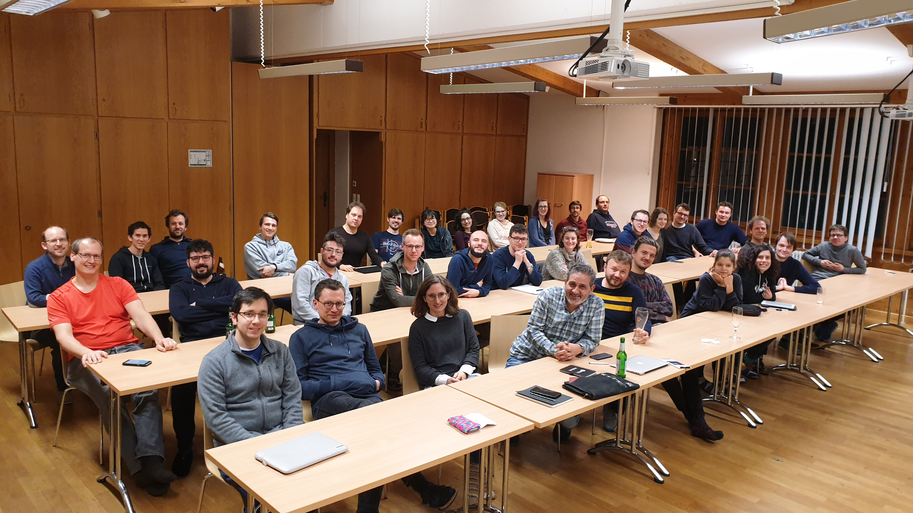

---
---
## Day 1 
We woke up to a spring snow shower which cheered us onto the day!

Emanuele Delucchi broke the ice and gave an overview of connections between the topology and combinatorics of abelian hyperplane arrangements.

Florian Kohl started us off with the first research talk, where we learned how to relate perfect graphs to unconditional reflexive polytopes (and chocolate).

For whoever got up in time to make sandwiches, it was then lunchtime. And later, off into the snow!

The afternoon came with a brand new topic for most of the participants: the combinatorics of zeta functions, explained enthusiastically by Christopher Voll. 

After many coffees, Karim Adiprasito took the stage, and kicked off the two part tutorial about the g-theorem.

Dinner was super tasty, even though the usual suspects whined about the pasta. And exciting times await us with the open mic and hopefully board games!

